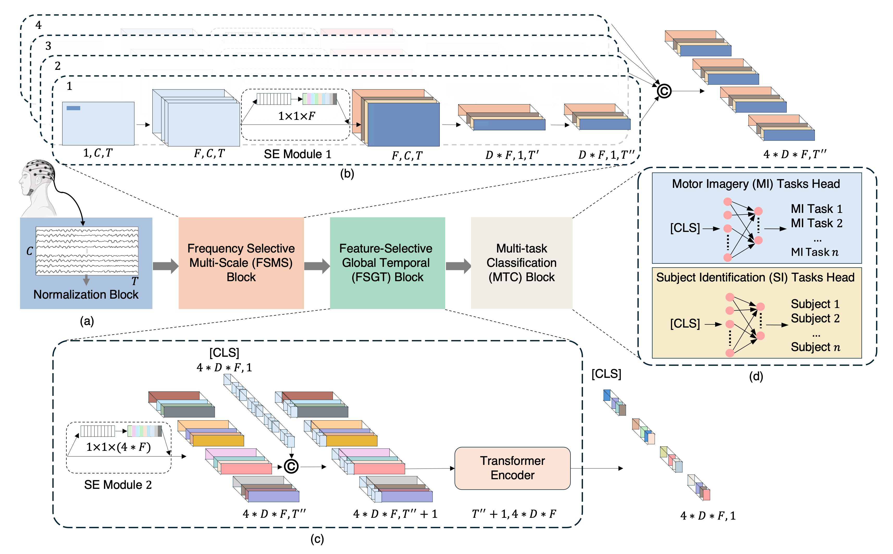

# EEG-based Motor Imagery empowered by Subject Identification in a Multi-task and Multi-scale framework

Official repository for the paper *"EEG-based Motor Imagery empowered by Subject Identification in a Multi-task and Multi-scale framework"*, introducing **MIRACLE**, a multi-task, multi-scale deep learning architecture for EEG-based Motor Imagery (MI) classification jointly trained with a Subject Identification (SI) auxiliary task.

> **Note:** This repository contains only the code required to **test/evaluate** the pretrained MIRACLE model. Pretrained model weights and the preprocessed test datasets are **not included** in this repository and must be downloaded separately (see [Download](#download) below).

---

## Table of Contents

- [Overview](#overview)
- [MIRACLE Architecture](#miracle-architecture)
- [Repository Structure](#repository-structure)
- [Requirements](#requirements)
- [Download](#download)
- [Datasets](#datasets)
- [Results](#results)
- [Usage](#usage)

---

## Overview

MIRACLE is designed to improve Motor Imagery decoding from EEG signals by leveraging subject-specific information through a multi-task learning framework, combined with a multi-scale, frequency-selective feature extraction strategy.

This repository provides the **test/inference pipeline** used to reproduce the evaluation results reported in the paper on the:
- **BCI Competition IV 2008 Dataset 2a**
- **BCI Competition IV 2008 Dataset 2b**
- **OpenBMI**
- **PhysioNetMI**

## MIRACLE Architecture

The figure below shows an overview of the proposed MIRACLE architecture, comprising:

- **(a) Normalization block** — based on Z-score standardization of the input EEG signals.
- **(b) Frequency-Selective Multi-Scale (FSMS) block** — four parallel convolutional branches paired with Squeeze-and-Excitation (SE) modules, designed to capture discriminative patterns across multiple frequency scales.
- **(c) Feature-Selective Global Temporal (FSGT) block** — integrates SE-based feature weighting with a Transformer encoder to model long-range temporal dependencies.
- **(d) Multi-Task Classification (MTC) block** — two classification heads, one for Motor Imagery (MI) classification and one for Subject Identification (SI), trained jointly to improve generalization and subject-invariant/subject-aware feature learning.

<p align="center">
  
</p>

<p align="center"><em>Figure: Overview of the proposed MIRACLE architecture — (a) normalization, (b) FSMS block, (c) FSGT block, (d) MTC block.</em></p>

## Repository Structure

```
.
├── README.md
├── requirements.txt
├── MIRACLE.py                       # MIRACLE model definition (FSMS, FSGT, MTC blocks)
├── test_motor_imagery.py            # Test / inference entry point
├── preprocess_test_OpenBMI.py       # Merges the split OpenBMI test set into a single .npz file
├── utils.py                         # Data loading, normalization, metrics, losses, network factory
├── Test_Sets/                       # >>> downloaded test data goes here (flat .npz files, no subfolders) <<<
│   ├── test_2a.npz
│   ├── test_2b.npz
│   ├── test_OpenBMI.npz             # created by preprocess_test_OpenBMI.py after merging the two downloaded parts
│   └── test_PhysioNetMI.npz
└── Weights_Models/                  # >>> downloaded model weights archive extracts here, with these subfolders already included <<<
    ├── Results_2a/
    │   ├── MIRACLE_mean_data.pt
    │   ├── MIRACLE_std_data.pt
    │   ├── MIRACLE_seed71_validation_log.txt
    │   └── MIRACLE_seed71_best_model_fold{N}.pth
    ├── Results_2b/
    │   ├── MIRACLE_mean_data.pt
    │   ├── MIRACLE_std_data.pt
    │   ├── MIRACLE_seed157_validation_log.txt
    │   └── MIRACLE_seed157_best_model_fold{N}.pth
    ├── Results_OpenBMI/
    │   ├── MIRACLE_mean_data.pt
    │   ├── MIRACLE_std_data.pt
    │   ├── MIRACLE_seed149_validation_log.txt
    │   └── MIRACLE_seed149_best_model_fold{N}.pth
    └── Results_PhysioNetMI/
        ├── MIRACLE_mean_data.pt
        ├── MIRACLE_std_data.pt
        ├── MIRACLE_seed131_validation_log.txt
        └── MIRACLE_seed131_best_model_fold{N}.pth
```

## Requirements

- Python 3.9
- PyTorch
- [einops](https://github.com/arogozhnikov/einops)
- NumPy
- scikit-learn
- Matplotlib
- Seaborn

Install all dependencies with:

```bash
pip install -r requirements.txt
```

## Download

Since the pretrained MIRACLE model weights and the preprocessed test datasets are not hosted in this repository, they must be downloaded from the corresponding release before running the test scripts:

- 🔗 **[Model weights release](https://github.com/MiviaLab/MIRACLE/releases/tag/Tag_Trained_Models)**
- 🔗 **[Test sets release](https://github.com/MiviaLab/MIRACLE/releases/tag/Tag_Test_Sets)**

- **Model weights**: distributed as a single archive that already contains the correct subfolder structure (`Weights_Models/Results_2a/`, `Weights_Models/Results_2b/`, `Weights_Models/Results_OpenBMI/`, `Weights_Models/Results_PhysioNetMI/`). Simply extract it in the repository root — no manual reorganization needed.
- **Test datasets**: distributed as individual `.npz` files. Create a `Test_Sets/` folder in the repository root (if not already present) and place all downloaded test files directly inside it (flat, no subfolders):

```
Test_Sets/test_2a.npz
Test_Sets/test_2b.npz
Test_Sets/test_OpenBMI_first.npz
Test_Sets/test_OpenBMI_last.npz
Test_Sets/test_PhysioNetMI.npz
```

> **Note on the OpenBMI test set:** since it exceeds 2GB, it is distributed split into two parts, `test_OpenBMI_first.npz` and `test_OpenBMI_last.npz`. After placing both inside `Test_Sets/`, merge them into a single `test_OpenBMI.npz` file by running:
>
> ```bash
> python preprocess_test_OpenBMI.py
> ```
>
> This concatenates the two parts into `Test_Sets/test_OpenBMI.npz` and automatically deletes the two original split files. All other test sets (2a, 2b, PhysioNetMI) are ready to use as downloaded, with no preprocessing needed.

Once everything is extracted and placed as described, the folder layout should match [Repository Structure](#repository-structure) above.

## Datasets

Evaluation is performed on the following public EEG Motor Imagery benchmarks:

- **BCI Competition IV — Dataset 2a**: 4-class Motor Imagery (left hand, right hand, feet, tongue), recorded from 9 subjects using 22 EEG channels.
- **BCI Competition IV — Dataset 2b**: 2-class Motor Imagery (left hand, right hand), recorded from 9 subjects using 3 EEG channels.
- **OpenBMI**: large-scale public EEG Motor Imagery dataset (Lee et al., 2019), 2-class Motor Imagery (left hand, right hand), recorded from 54 subjects using 62 EEG channels.
- **PhysioNetMI**: EEG Motor Movement/Imagery dataset (Schalk et al., 2004), 2-class Motor Imagery (left hand, right hand), evaluated here on 106 subjects using 64 EEG channels.

Only the **test partitions** required to reproduce the paper's results are provided via the download link above; the raw/original datasets are publicly available from the respective official sources for research purposes.

During training, the MI and SI task losses are combined with a weighting coefficient **α**, set to **0.001** for Dataset 2a, **0.01** for Dataset 2b, **0.001** for OpenBMI, and **0.1** for PhysioNetMI.

## Results

The tables below report the per-subject classification accuracy (%) obtained on the test sets, across **all the seeds evaluated** for each dataset. **For simplicity, only the model weights of the best-performing seed per dataset are made available for download** (highlighted in bold below): seed **71** for Dataset 2a and seed **157** for Dataset 2b.

### Dataset 2a (α = 0.001)

| Seed | S1 | S2 | S3 | S4 | S5 | S6 | S7 | S8 | S9 | **Average** |
|---|---|---|---|---|---|---|---|---|---|---|
| 42 | 87.15 | 64.24 | 94.44 | 77.78 | 54.51 | 68.06 | 87.85 | 85.76 | 78.12 | 77.55 |
| **71 (best)** | **86.81** | **70.49** | **94.44** | **81.94** | **67.01** | **70.14** | **87.50** | **86.81** | **77.78** | **80.32** |
| 101 | 86.46 | 68.75 | 92.71 | 79.17 | 45.49 | 65.97 | 81.94 | 84.72 | 82.64 | 76.43 |
| 113 | 85.76 | 66.32 | 94.44 | 77.78 | 61.11 | 67.71 | 90.28 | 86.81 | 84.38 | 79.40 |
| 127 | 86.46 | 59.37 | 95.14 | 77.43 | 75.69 | 65.97 | 85.76 | 82.64 | 77.78 | 78.47 |
| 131 | 84.03 | 58.33 | 93.75 | 78.12 | 71.87 | 67.36 | 89.24 | 85.07 | 74.31 | 78.01 |
| 139 | 85.07 | 58.68 | 93.75 | 78.12 | 57.99 | 64.58 | 89.93 | 86.11 | 77.78 | 76.89 |
| 149 | 86.11 | 65.28 | 95.49 | 76.74 | 48.96 | 70.14 | 90.28 | 88.19 | 82.99 | 78.24 |
| 157 | 86.46 | 58.33 | 94.79 | 79.17 | 54.51 | 69.44 | 85.42 | 86.81 | 86.11 | 77.89 |
| 163 | 84.38 | 61.46 | 94.79 | 73.61 | 54.86 | 67.01 | 89.24 | 82.99 | 79.17 | 76.39 |
| 173 | 86.81 | 58.33 | 93.40 | 73.61 | 52.08 | 64.58 | 73.61 | 87.50 | 82.64 | 74.73 |
| 181 | 85.76 | 67.36 | 95.49 | 78.82 | 52.43 | 64.93 | 81.60 | 85.07 | 80.90 | 76.93 |
| 322 | 85.42 | 64.58 | 95.14 | 81.94 | 48.96 | 67.71 | 86.11 | 87.15 | 80.21 | 77.47 |
| 521 | 82.99 | 63.19 | 94.10 | 77.78 | 61.46 | 69.10 | 88.54 | 84.38 | 81.25 | 78.09 |
| *Average* | *85.69* | *63.19* | *94.42* | *78.00* | *57.64* | *67.34* | *86.24* | *85.72* | *80.43* | *77.63* |

> Values are per-subject classification accuracy (%) on the MI task test set. The bolded row (seed **71**) is the one whose model weights are provided via the [Download](#download) link and used in the [Usage](#usage) example commands below.

### Dataset 2b (α = 0.01)

| Seed | S1 | S2 | S3 | S4 | S5 | S6 | S7 | S8 | S9 | **Average** |
|---|---|---|---|---|---|---|---|---|---|---|
| 42 | 78.75 | 73.21 | 82.19 | 93.44 | 97.50 | 85.00 | 91.87 | 96.56 | 87.19 | 87.30 |
| 71 | 78.12 | 72.14 | 82.50 | 94.69 | 99.06 | 82.19 | 91.87 | 96.25 | 89.06 | 87.32 |
| 101 | 79.37 | 72.14 | 84.38 | 95.00 | 98.44 | 88.75 | 91.87 | 96.88 | 87.19 | 88.22 |
| 113 | 78.12 | 72.50 | 83.44 | 96.25 | 98.44 | 88.12 | 92.81 | 95.63 | 86.56 | 87.99 |
| 127 | 79.37 | 71.07 | 82.81 | 94.38 | 97.50 | 85.31 | 92.50 | 95.94 | 88.44 | 87.48 |
| 131 | 77.81 | 70.36 | 82.19 | 95.63 | 96.88 | 86.87 | 91.25 | 95.94 | 86.87 | 87.09 |
| 139 | 75.00 | 71.43 | 83.75 | 89.69 | 97.81 | 87.50 | 93.75 | 96.25 | 88.12 | 87.03 |
| 149 | 78.44 | 69.64 | 84.69 | 95.94 | 98.12 | 83.44 | 91.56 | 95.31 | 87.81 | 87.22 |
| **157 (best)** | **79.37** | **74.29** | **86.25** | **93.44** | **97.50** | **89.06** | **92.19** | **97.19** | **89.69** | **88.78** |
| 163 | 78.44 | 72.86 | 85.31 | 94.69 | 98.12 | 85.62 | 91.25 | 96.25 | 87.50 | 87.78 |
| 173 | 79.06 | 71.07 | 82.19 | 95.63 | 97.81 | 84.06 | 92.50 | 95.94 | 88.13 | 87.38 |
| 181 | 77.50 | 71.43 | 84.38 | 93.44 | 98.12 | 88.13 | 92.81 | 95.94 | 87.81 | 87.73 |
| 322 | 76.56 | 72.14 | 85.31 | 95.00 | 98.12 | 87.50 | 92.19 | 96.56 | 89.06 | 88.05 |
| 521 | 81.25 | 73.57 | 85.00 | 95.63 | 97.81 | 86.25 | 92.81 | 95.31 | 87.81 | 88.38 |
| *Average* | *78.37* | *71.99* | *83.88* | *94.49* | *97.94* | *86.27* | *92.23* | *96.14* | *87.95* | *87.70* |

> Values are per-subject classification accuracy (%) on the MI task test set. The bolded row (seed **157**) is the one whose model weights are provided via the [Download](#download) link and used in the [Usage](#usage) example commands below.

### Dataset OpenBMI (α = 0.001)

| Subject | 42 | 71 | 101 | 113 | 127 | 131 | 139 | **149** | 157 | 163 | 173 | 181 | 322 | 521 | **Average** |
|---|---|---|---|---|---|---|---|---|---|---|---|---|---|---|---|
| S1 | 87.00 | 84.50 | 85.00 | 87.00 | 83.00 | 85.50 | 86.00 | **83.50** | 85.50 | 84.50 | 81.00 | 85.00 | 86.00 | 82.00 | **84.68** |
| S2 | 79.00 | 84.00 | 80.50 | 81.50 | 84.00 | 78.50 | 84.50 | **82.50** | 79.50 | 80.00 | 81.00 | 80.00 | 81.00 | 82.00 | **81.29** |
| S3 | 98.50 | 98.00 | 97.00 | 98.50 | 97.00 | 96.00 | 98.50 | **99.00** | 99.50 | 97.50 | 97.00 | 98.00 | 98.00 | 97.50 | **97.86** |
| S4 | 87.50 | 86.50 | 80.50 | 83.50 | 88.00 | 87.00 | 86.50 | **90.50** | 84.50 | 88.50 | 86.00 | 89.00 | 91.00 | 90.00 | **87.07** |
| S5 | 86.00 | 89.50 | 89.50 | 88.00 | 92.00 | 87.50 | 92.00 | **90.00** | 87.50 | 85.00 | 87.50 | 86.50 | 88.50 | 89.00 | **88.46** |
| S6 | 99.00 | 97.50 | 98.00 | 97.50 | 99.50 | 98.00 | 98.00 | **99.00** | 98.00 | 99.00 | 98.00 | 98.50 | 99.50 | 98.50 | **98.43** |
| S7 | 83.50 | 85.00 | 80.00 | 85.00 | 86.50 | 83.50 | 86.00 | **85.00** | 84.50 | 86.50 | 86.00 | 88.00 | 84.00 | 87.50 | **85.07** |
| S8 | 88.00 | 87.50 | 86.00 | 87.50 | 88.00 | 85.00 | 91.50 | **88.50** | 89.50 | 86.50 | 87.00 | 85.00 | 86.00 | 85.50 | **87.25** |
| S9 | 83.50 | 82.50 | 85.50 | 82.50 | 82.50 | 82.50 | 85.00 | **82.00** | 85.50 | 82.50 | 82.50 | 82.00 | 84.00 | 84.50 | **83.36** |
| S10 | 68.00 | 66.50 | 67.00 | 71.50 | 68.50 | 67.00 | 73.50 | **68.00** | 72.00 | 67.00 | 66.00 | 67.50 | 72.50 | 69.00 | **68.86** |
| S11 | 73.00 | 73.00 | 73.00 | 72.50 | 73.00 | 73.00 | 72.00 | **75.50** | 72.50 | 74.00 | 76.00 | 73.00 | 73.00 | 73.50 | **73.36** |
| S12 | 86.00 | 84.00 | 86.00 | 84.50 | 82.00 | 82.00 | 83.00 | **83.00** | 84.00 | 83.00 | 83.00 | 87.00 | 85.00 | 81.50 | **83.86** |
| S13 | 77.00 | 78.50 | 71.50 | 70.50 | 73.50 | 78.50 | 70.50 | **79.50** | 77.00 | 72.00 | 73.00 | 74.50 | 71.00 | 74.50 | **74.39** |
| S14 | 72.00 | 62.00 | 72.00 | 76.00 | 66.50 | 68.50 | 70.00 | **72.50** | 68.00 | 67.50 | 81.00 | 71.50 | 74.00 | 65.50 | **70.50** |
| S15 | 91.00 | 85.00 | 89.00 | 87.50 | 86.00 | 90.00 | 83.50 | **89.50** | 87.00 | 90.00 | 84.50 | 88.00 | 89.00 | 88.50 | **87.75** |
| S16 | 93.00 | 91.50 | 92.00 | 90.50 | 92.50 | 93.50 | 92.50 | **92.00** | 92.50 | 90.00 | 91.50 | 91.50 | 90.50 | 92.00 | **91.82** |
| S17 | 75.00 | 70.00 | 75.50 | 71.50 | 74.00 | 71.00 | 76.00 | **72.50** | 71.00 | 71.50 | 69.00 | 67.00 | 69.50 | 68.50 | **71.57** |
| S18 | 94.50 | 89.00 | 94.50 | 89.50 | 94.00 | 94.00 | 93.50 | **95.50** | 96.00 | 87.50 | 93.50 | 96.00 | 92.00 | 93.00 | **93.04** |
| S19 | 84.50 | 82.50 | 88.50 | 82.00 | 88.00 | 84.50 | 86.00 | **86.00** | 85.00 | 85.00 | 86.00 | 88.50 | 84.50 | 83.50 | **85.32** |
| S20 | 94.50 | 89.50 | 92.00 | 92.00 | 93.00 | 93.50 | 91.50 | **92.00** | 93.00 | 93.00 | 91.50 | 94.00 | 91.50 | 93.00 | **92.43** |
| S21 | 99.00 | 99.50 | 100.00 | 99.00 | 100.00 | 100.00 | 100.00 | **100.00** | 99.50 | 99.50 | 98.50 | 98.50 | 100.00 | 100.00 | **99.54** |
| S22 | 83.50 | 85.50 | 84.50 | 83.00 | 84.50 | 84.00 | 85.50 | **84.50** | 84.50 | 81.00 | 84.00 | 85.50 | 79.50 | 84.00 | **83.82** |
| S23 | 75.50 | 74.00 | 76.00 | 76.00 | 76.00 | 69.50 | 71.50 | **67.50** | 74.00 | 79.00 | 74.50 | 74.00 | 73.00 | 70.00 | **73.61** |
| S24 | 60.50 | 55.00 | 65.00 | 62.50 | 53.50 | 60.50 | 56.50 | **59.50** | 61.00 | 61.50 | 66.00 | 60.50 | 63.00 | 61.00 | **60.43** |
| S25 | 99.00 | 99.00 | 99.50 | 98.50 | 98.00 | 99.50 | 97.50 | **98.00** | 99.00 | 99.00 | 99.50 | 99.00 | 99.00 | 99.00 | **98.82** |
| S26 | 83.00 | 86.00 | 85.50 | 82.00 | 86.00 | 85.50 | 85.50 | **84.00** | 86.50 | 85.50 | 89.00 | 85.00 | 85.50 | 87.00 | **85.43** |
| S27 | 94.50 | 93.50 | 93.50 | 93.00 | 86.50 | 94.00 | 91.00 | **94.50** | 92.50 | 94.00 | 95.00 | 92.50 | 93.50 | 94.00 | **93.00** |
| S28 | 96.50 | 96.00 | 97.00 | 98.50 | 93.50 | 97.50 | 95.00 | **96.00** | 96.00 | 97.50 | 96.00 | 97.50 | 98.00 | 95.50 | **96.46** |
| S29 | 86.50 | 90.50 | 85.00 | 88.00 | 92.00 | 86.00 | 87.50 | **90.00** | 87.00 | 87.50 | 87.50 | 89.50 | 86.50 | 88.50 | **88.00** |
| S30 | 75.00 | 73.00 | 74.50 | 76.50 | 74.00 | 73.50 | 75.00 | **76.50** | 78.50 | 72.00 | 74.00 | 76.50 | 74.00 | 75.00 | **74.86** |
| S31 | 87.00 | 86.00 | 87.00 | 85.00 | 85.50 | 86.50 | 87.00 | **86.00** | 83.00 | 84.50 | 86.50 | 85.50 | 85.00 | 88.00 | **85.89** |
| S32 | 96.00 | 97.50 | 98.00 | 98.00 | 97.00 | 97.00 | 98.50 | **98.00** | 97.50 | 97.50 | 97.50 | 96.50 | 97.50 | 96.50 | **97.36** |
| S33 | 98.50 | 98.50 | 98.00 | 97.50 | 98.50 | 98.00 | 98.00 | **99.00** | 98.00 | 98.00 | 98.00 | 98.50 | 99.00 | 98.50 | **98.29** |
| S34 | 66.00 | 66.00 | 69.50 | 67.00 | 71.50 | 62.50 | 65.50 | **67.50** | 67.00 | 62.50 | 70.00 | 67.00 | 66.00 | 66.50 | **66.75** |
| S35 | 91.50 | 95.00 | 93.00 | 93.50 | 92.00 | 92.50 | 94.50 | **95.50** | 95.00 | 93.50 | 93.50 | 93.50 | 93.00 | 93.50 | **93.54** |
| S36 | 99.00 | 99.00 | 98.50 | 100.00 | 98.50 | 99.50 | 98.50 | **98.50** | 99.00 | 99.00 | 100.00 | 98.50 | 99.50 | 100.00 | **99.11** |
| S37 | 97.00 | 97.00 | 95.50 | 96.50 | 97.00 | 93.00 | 98.00 | **98.00** | 96.50 | 96.00 | 97.50 | 96.00 | 96.50 | 98.50 | **96.64** |
| S38 | 73.50 | 79.00 | 72.50 | 71.00 | 74.50 | 74.00 | 81.50 | **81.00** | 80.00 | 70.50 | 78.00 | 84.50 | 77.00 | 80.50 | **76.96** |
| S39 | 89.00 | 90.00 | 87.50 | 88.50 | 86.50 | 90.00 | 90.00 | **90.00** | 88.50 | 87.00 | 88.00 | 89.00 | 90.00 | 89.50 | **88.82** |
| S40 | 82.50 | 81.50 | 80.50 | 80.50 | 85.00 | 79.00 | 83.50 | **83.00** | 78.50 | 82.50 | 79.50 | 89.00 | 78.50 | 83.50 | **81.93** |
| S41 | 75.00 | 77.50 | 77.50 | 79.00 | 79.00 | 76.00 | 82.50 | **80.50** | 79.00 | 78.00 | 82.50 | 80.50 | 80.50 | 82.50 | **79.29** |
| S42 | 76.50 | 77.50 | 75.50 | 76.50 | 77.00 | 77.00 | 74.00 | **74.00** | 77.00 | 76.00 | 76.50 | 76.00 | 76.00 | 74.50 | **76.00** |
| S43 | 89.50 | 87.50 | 86.50 | 87.00 | 89.50 | 90.00 | 89.00 | **93.50** | 87.50 | 88.00 | 84.00 | 90.00 | 88.50 | 90.50 | **88.64** |
| S44 | 95.50 | 94.00 | 95.50 | 95.50 | 91.50 | 95.50 | 93.00 | **93.50** | 96.00 | 95.50 | 95.00 | 95.50 | 96.00 | 94.00 | **94.71** |
| S45 | 90.00 | 93.00 | 91.00 | 92.50 | 90.50 | 93.50 | 91.50 | **89.50** | 90.00 | 92.00 | 88.50 | 92.00 | 92.50 | 91.50 | **91.29** |
| S46 | 85.50 | 81.50 | 83.50 | 86.50 | 81.00 | 82.50 | 84.00 | **85.50** | 83.00 | 84.50 | 85.00 | 84.00 | 81.00 | 84.50 | **83.71** |
| S47 | 88.00 | 91.00 | 92.50 | 91.00 | 91.50 | 93.00 | 93.00 | **91.50** | 92.00 | 89.50 | 94.00 | 96.50 | 87.00 | 93.50 | **91.71** |
| S48 | 82.00 | 83.00 | 82.50 | 84.50 | 83.00 | 78.50 | 79.00 | **83.00** | 81.00 | 81.50 | 82.00 | 85.50 | 80.50 | 83.00 | **82.07** |
| S49 | 89.50 | 92.50 | 86.50 | 85.50 | 88.50 | 87.50 | 89.50 | **93.50** | 88.50 | 90.00 | 83.50 | 89.50 | 90.00 | 89.00 | **88.82** |
| S50 | 55.50 | 62.00 | 61.50 | 62.50 | 65.50 | 57.00 | 59.00 | **61.00** | 61.50 | 53.00 | 65.50 | 56.50 | 57.50 | 61.00 | **59.93** |
| S51 | 83.50 | 83.50 | 84.00 | 83.00 | 84.00 | 81.00 | 84.50 | **82.50** | 86.00 | 84.50 | 83.50 | 82.00 | 85.00 | 82.50 | **83.54** |
| S52 | 90.00 | 90.50 | 90.00 | 92.00 | 90.50 | 92.00 | 89.50 | **92.00** | 89.50 | 88.50 | 93.00 | 91.00 | 89.50 | 92.00 | **90.71** |
| S53 | 79.50 | 80.50 | 79.00 | 82.00 | 80.00 | 79.50 | 79.50 | **76.00** | 79.00 | 78.50 | 80.50 | 78.00 | 82.00 | 84.00 | **79.86** |
| S54 | 75.50 | 75.00 | 76.00 | 73.00 | 72.00 | 74.50 | 72.00 | **72.50** | 73.00 | 72.50 | 74.00 | 76.00 | 74.50 | 71.00 | **73.68** |
| *Average* | *84.98* | *84.76* | *84.91* | *84.89* | *84.91* | *84.42* | *85.19* | **85.58** | *85.12* | *84.26* | *85.20* | *85.56* | *84.91* | *85.21* | ***84.99*** |

> Values are per-subject classification accuracy (%) on the MI task test set; subjects are listed as rows and seeds as columns (the opposite orientation of the BCI IV 2a/2b tables above, given the larger number of subjects). The bolded column (seed **149**) is the one whose model weights are provided via the [Download](#download) link and used in the [Usage](#usage) example commands below.

### Dataset PhysioNetMI (α = 0.1)

| Subject | 42 | 71 | 101 | 113 | 127 | **131** | 139 | 149 | 157 | 163 | 173 | 181 | 322 | 521 | **Average** |
|---|---|---|---|---|---|---|---|---|---|---|---|---|---|---|---|
| S1 | 92.86 | 86.61 | 86.61 | 86.61 | 86.61 | **86.61** | 86.61 | 86.61 | 86.61 | 86.61 | 92.86 | 92.86 | 86.61 | 86.61 | **87.95** |
| S2 | 86.61 | 80.36 | 85.71 | 85.71 | 86.61 | **85.71** | 93.75 | 85.71 | 100.00 | 85.71 | 100.00 | 79.46 | 100.00 | 86.61 | **88.71** |
| S3 | 80.36 | 74.11 | 74.11 | 67.86 | 74.11 | **80.36** | 74.11 | 86.61 | 67.86 | 74.11 | 80.36 | 80.36 | 74.11 | 80.36 | **76.34** |
| S4 | 100.00 | 93.75 | 100.00 | 100.00 | 100.00 | **100.00** | 92.86 | 92.86 | 87.50 | 100.00 | 100.00 | 92.86 | 100.00 | 100.00 | **97.13** |
| S5 | 54.46 | 66.96 | 54.46 | 54.46 | 60.71 | **67.86** | 66.96 | 48.21 | 66.96 | 54.46 | 54.46 | 48.21 | 55.36 | 54.46 | **57.71** |
| S6 | 92.86 | 92.86 | 92.86 | 100.00 | 100.00 | **100.00** | 92.86 | 85.71 | 92.86 | 100.00 | 92.86 | 92.86 | 85.71 | 100.00 | **94.39** |
| S7 | 100.00 | 100.00 | 100.00 | 100.00 | 100.00 | **100.00** | 100.00 | 100.00 | 100.00 | 100.00 | 100.00 | 100.00 | 100.00 | 100.00 | **100.00** |
| S8 | 87.50 | 87.50 | 93.75 | 87.50 | 93.75 | **93.75** | 93.75 | 93.75 | 93.75 | 87.50 | 87.50 | 93.75 | 86.61 | 87.50 | **90.56** |
| S9 | 87.50 | 80.36 | 66.96 | 79.46 | 74.11 | **74.11** | 87.50 | 79.46 | 81.25 | 87.50 | 87.50 | 79.46 | 73.21 | 87.50 | **80.42** |
| S10 | 73.21 | 66.07 | 86.61 | 66.07 | 73.21 | **73.21** | 79.46 | 66.07 | 80.36 | 73.21 | 80.36 | 72.32 | 80.36 | 86.61 | **75.51** |
| S11 | 78.57 | 93.75 | 87.50 | 85.71 | 85.71 | **85.71** | 85.71 | 85.71 | 85.71 | 92.86 | 100.00 | 78.57 | 85.71 | 92.86 | **87.43** |
| S12 | 80.36 | 86.61 | 92.86 | 86.61 | 86.61 | **92.86** | 92.86 | 92.86 | 92.86 | 92.86 | 86.61 | 86.61 | 80.36 | 86.61 | **88.40** |
| S13 | 67.86 | 59.82 | 67.86 | 79.46 | 66.96 | **73.21** | 74.11 | 75.00 | 54.46 | 60.71 | 73.21 | 59.82 | 66.96 | 75.00 | **68.17** |
| S14 | 80.36 | 74.11 | 86.61 | 73.21 | 67.86 | **86.61** | 86.61 | 86.61 | 87.50 | 93.75 | 74.11 | 93.75 | 85.71 | 93.75 | **83.61** |
| S15 | 100.00 | 100.00 | 100.00 | 100.00 | 100.00 | **100.00** | 100.00 | 100.00 | 100.00 | 100.00 | 100.00 | 100.00 | 100.00 | 100.00 | **100.00** |
| S16 | 65.18 | 57.14 | 71.43 | 64.29 | 64.29 | **51.79** | 50.89 | 78.57 | 78.57 | 73.21 | 57.14 | 66.07 | 68.75 | 57.14 | **64.60** |
| S17 | 92.86 | 92.86 | 100.00 | 85.71 | 85.71 | **92.86** | 100.00 | 100.00 | 92.86 | 92.86 | 85.71 | 86.61 | 92.86 | 85.71 | **91.90** |
| S18 | 100.00 | 100.00 | 100.00 | 100.00 | 100.00 | **100.00** | 100.00 | 100.00 | 100.00 | 100.00 | 100.00 | 100.00 | 100.00 | 100.00 | **100.00** |
| S19 | 86.61 | 86.61 | 80.36 | 79.46 | 79.46 | **86.61** | 81.25 | 86.61 | 87.50 | 80.36 | 79.46 | 79.46 | 86.61 | 73.21 | **82.40** |
| S20 | 92.86 | 92.86 | 92.86 | 100.00 | 92.86 | **92.86** | 100.00 | 92.86 | 92.86 | 100.00 | 92.86 | 85.71 | 92.86 | 92.86 | **93.88** |
| S21 | 61.61 | 62.50 | 55.36 | 55.36 | 62.50 | **61.61** | 68.75 | 62.50 | 62.50 | 62.50 | 68.75 | 55.36 | 81.25 | 62.50 | **63.08** |
| S22 | 100.00 | 100.00 | 100.00 | 100.00 | 100.00 | **100.00** | 100.00 | 100.00 | 100.00 | 100.00 | 100.00 | 100.00 | 100.00 | 100.00 | **100.00** |
| S23 | 85.71 | 85.71 | 92.86 | 85.71 | 86.61 | **78.57** | 78.57 | 80.36 | 80.36 | 86.61 | 85.71 | 85.71 | 85.71 | 86.61 | **84.63** |
| S24 | 68.75 | 55.36 | 67.86 | 80.36 | 75.00 | **62.50** | 67.86 | 81.25 | 67.86 | 67.86 | 62.50 | 61.61 | 74.11 | 68.75 | **68.69** |
| S25 | 87.50 | 55.36 | 50.00 | 75.00 | 68.75 | **68.75** | 75.00 | 62.50 | 62.50 | 62.50 | 56.25 | 80.36 | 81.25 | 68.75 | **68.18** |
| S26 | 33.04 | 32.14 | 38.39 | 39.29 | 21.43 | **26.79** | 27.68 | 26.79 | 20.54 | 33.04 | 32.14 | 25.89 | 25.89 | 26.79 | **29.27** |
| S27 | 80.36 | 74.11 | 73.21 | 66.96 | 74.11 | **66.96** | 73.21 | 74.11 | 74.11 | 66.96 | 74.11 | 73.21 | 79.46 | 79.46 | **73.60** |
| S28 | 79.46 | 73.21 | 66.96 | 87.50 | 66.96 | **86.61** | 73.21 | 66.96 | 74.11 | 74.11 | 80.36 | 73.21 | 66.96 | 79.46 | **74.93** |
| S29 | 85.71 | 85.71 | 92.86 | 85.71 | 85.71 | **85.71** | 85.71 | 85.71 | 85.71 | 86.61 | 85.71 | 85.71 | 85.71 | 92.86 | **86.80** |
| S30 | 86.61 | 86.61 | 86.61 | 80.36 | 80.36 | **86.61** | 80.36 | 80.36 | 80.36 | 80.36 | 86.61 | 86.61 | 86.61 | 86.61 | **83.93** |
| S31 | 93.75 | 93.75 | 86.61 | 87.50 | 86.61 | **93.75** | 87.50 | 93.75 | 93.75 | 93.75 | 93.75 | 93.75 | 80.36 | 86.61 | **90.37** |
| S32 | 100.00 | 100.00 | 93.75 | 100.00 | 100.00 | **92.86** | 92.86 | 92.86 | 100.00 | 92.86 | 100.00 | 100.00 | 92.86 | 92.86 | **96.49** |
| S33 | 93.75 | 75.00 | 93.75 | 93.75 | 93.75 | **100.00** | 87.50 | 100.00 | 100.00 | 100.00 | 100.00 | 100.00 | 93.75 | 93.75 | **94.64** |
| S34 | 71.43 | 71.43 | 85.71 | 78.57 | 78.57 | **71.43** | 57.14 | 85.71 | 78.57 | 85.71 | 92.86 | 64.29 | 100.00 | 78.57 | **78.57** |
| S35 | 78.57 | 78.57 | 78.57 | 78.57 | 78.57 | **78.57** | 78.57 | 71.43 | 78.57 | 85.71 | 85.71 | 78.57 | 78.57 | 78.57 | **79.08** |
| S36 | 74.11 | 74.11 | 80.36 | 80.36 | 80.36 | **80.36** | 74.11 | 80.36 | 80.36 | 74.11 | 74.11 | 74.11 | 74.11 | 74.11 | **76.79** |
| S37 | 92.86 | 92.86 | 92.86 | 71.43 | 92.86 | **85.71** | 92.86 | 85.71 | 85.71 | 57.14 | 85.71 | 92.86 | 71.43 | 85.71 | **84.69** |
| S38 | 67.86 | 60.71 | 56.25 | 75.00 | 66.96 | **73.21** | 56.25 | 56.25 | 48.21 | 49.11 | 66.07 | 55.36 | 62.50 | 62.50 | **61.16** |
| S39 | 59.82 | 81.25 | 81.25 | 66.96 | 80.36 | **81.25** | 81.25 | 81.25 | 80.36 | 81.25 | 66.96 | 81.25 | 66.96 | 81.25 | **76.53** |
| S40 | 100.00 | 100.00 | 100.00 | 100.00 | 93.75 | **100.00** | 93.75 | 100.00 | 100.00 | 100.00 | 100.00 | 100.00 | 93.75 | 100.00 | **98.66** |
| S41 | 100.00 | 100.00 | 100.00 | 93.75 | 93.75 | **93.75** | 93.75 | 93.75 | 93.75 | 100.00 | 93.75 | 100.00 | 100.00 | 100.00 | **96.88** |
| S42 | 85.71 | 92.86 | 85.71 | 92.86 | 85.71 | **85.71** | 86.61 | 92.86 | 92.86 | 87.50 | 92.86 | 85.71 | 92.86 | 78.57 | **88.46** |
| S43 | 86.61 | 79.46 | 78.57 | 86.61 | 85.71 | **86.61** | 79.46 | 93.75 | 72.32 | 72.32 | 93.75 | 79.46 | 93.75 | 79.46 | **83.42** |
| S44 | 87.50 | 80.36 | 87.50 | 87.50 | 87.50 | **80.36** | 80.36 | 87.50 | 87.50 | 87.50 | 87.50 | 81.25 | 80.36 | 87.50 | **85.01** |
| S45 | 54.46 | 60.71 | 60.71 | 61.61 | 60.71 | **60.71** | 60.71 | 67.86 | 67.86 | 67.86 | 60.71 | 61.61 | 60.71 | 60.71 | **61.92** |
| S46 | 60.71 | 52.68 | 66.07 | 52.68 | 59.82 | **66.96** | 52.68 | 60.71 | 66.96 | 60.71 | 74.11 | 52.68 | 59.82 | 59.82 | **60.46** |
| S47 | 85.71 | 92.86 | 85.71 | 86.61 | 86.61 | **81.25** | 81.25 | 75.00 | 75.00 | 87.50 | 79.46 | 86.61 | 79.46 | 93.75 | **84.06** |
| S48 | 92.86 | 100.00 | 100.00 | 92.86 | 100.00 | **100.00** | 100.00 | 100.00 | 100.00 | 100.00 | 100.00 | 100.00 | 100.00 | 92.86 | **98.47** |
| S49 | 80.36 | 80.36 | 86.61 | 100.00 | 87.50 | **80.36** | 86.61 | 100.00 | 92.86 | 86.61 | 93.75 | 87.50 | 80.36 | 100.00 | **88.78** |
| S50 | 80.36 | 79.46 | 85.71 | 80.36 | 87.50 | **93.75** | 72.32 | 66.07 | 80.36 | 80.36 | 79.46 | 71.43 | 71.43 | 87.50 | **79.72** |
| S51 | 64.29 | 71.43 | 78.57 | 78.57 | 86.61 | **92.86** | 79.46 | 100.00 | 85.71 | 92.86 | 78.57 | 92.86 | 66.96 | 92.86 | **82.97** |
| S52 | 100.00 | 100.00 | 100.00 | 100.00 | 100.00 | **100.00** | 92.86 | 100.00 | 100.00 | 100.00 | 100.00 | 100.00 | 92.86 | 100.00 | **98.98** |
| S53 | 93.75 | 100.00 | 100.00 | 100.00 | 93.75 | **100.00** | 100.00 | 100.00 | 93.75 | 93.75 | 100.00 | 100.00 | 100.00 | 93.75 | **97.77** |
| S54 | 100.00 | 92.86 | 100.00 | 93.75 | 100.00 | **100.00** | 100.00 | 100.00 | 93.75 | 100.00 | 100.00 | 93.75 | 86.61 | 100.00 | **97.19** |
| S55 | 86.61 | 86.61 | 86.61 | 92.86 | 86.61 | **92.86** | 86.61 | 92.86 | 92.86 | 92.86 | 86.61 | 92.86 | 86.61 | 92.86 | **89.73** |
| S56 | 100.00 | 92.86 | 92.86 | 100.00 | 92.86 | **100.00** | 100.00 | 100.00 | 100.00 | 85.71 | 100.00 | 92.86 | 85.71 | 100.00 | **95.92** |
| S57 | 93.75 | 93.75 | 93.75 | 93.75 | 93.75 | **100.00** | 93.75 | 93.75 | 100.00 | 93.75 | 93.75 | 93.75 | 93.75 | 93.75 | **94.64** |
| S58 | 87.50 | 80.36 | 85.71 | 80.36 | 80.36 | **86.61** | 86.61 | 87.50 | 86.61 | 87.50 | 87.50 | 86.61 | 93.75 | 87.50 | **86.03** |
| S59 | 59.82 | 51.79 | 58.93 | 73.21 | 52.68 | **52.68** | 66.07 | 52.68 | 58.93 | 66.07 | 58.93 | 66.07 | 65.18 | 66.07 | **60.65** |
| S60 | 93.75 | 93.75 | 86.61 | 100.00 | 93.75 | **93.75** | 93.75 | 100.00 | 93.75 | 93.75 | 93.75 | 100.00 | 93.75 | 100.00 | **95.03** |
| S61 | 100.00 | 100.00 | 100.00 | 92.86 | 100.00 | **92.86** | 92.86 | 92.86 | 92.86 | 100.00 | 92.86 | 100.00 | 92.86 | 100.00 | **96.43** |
| S62 | 100.00 | 100.00 | 100.00 | 92.86 | 100.00 | **100.00** | 100.00 | 100.00 | 93.75 | 100.00 | 100.00 | 100.00 | 100.00 | 100.00 | **99.04** |
| S63 | 58.93 | 66.96 | 65.18 | 73.21 | 73.21 | **73.21** | 66.07 | 65.18 | 58.93 | 73.21 | 74.11 | 73.21 | 65.18 | 65.18 | **67.98** |
| S64 | 64.29 | 57.14 | 50.00 | 50.00 | 50.00 | **57.14** | 50.00 | 50.00 | 57.14 | 50.00 | 50.00 | 57.14 | 57.14 | 57.14 | **54.08** |
| S65 | 81.25 | 81.25 | 87.50 | 87.50 | 87.50 | **87.50** | 87.50 | 87.50 | 87.50 | 80.36 | 87.50 | 87.50 | 86.61 | 87.50 | **86.03** |
| S66 | 65.18 | 72.32 | 66.07 | 80.36 | 80.36 | **80.36** | 80.36 | 73.21 | 73.21 | 73.21 | 66.07 | 79.46 | 74.11 | 80.36 | **74.62** |
| S67 | 52.68 | 51.79 | 64.29 | 64.29 | 57.14 | **64.29** | 64.29 | 64.29 | 64.29 | 57.14 | 64.29 | 39.29 | 50.89 | 64.29 | **58.80** |
| S68 | 87.50 | 81.25 | 87.50 | 81.25 | 81.25 | **87.50** | 87.50 | 81.25 | 81.25 | 87.50 | 81.25 | 75.00 | 81.25 | 87.50 | **83.48** |
| S69 | 79.46 | 93.75 | 100.00 | 93.75 | 92.86 | **93.75** | 86.61 | 93.75 | 86.61 | 92.86 | 79.46 | 85.71 | 78.57 | 79.46 | **88.33** |
| S70 | 100.00 | 100.00 | 100.00 | 100.00 | 100.00 | **100.00** | 100.00 | 100.00 | 100.00 | 100.00 | 100.00 | 100.00 | 100.00 | 100.00 | **100.00** |
| S71 | 73.21 | 87.50 | 80.36 | 87.50 | 86.61 | **87.50** | 73.21 | 87.50 | 93.75 | 87.50 | 73.21 | 80.36 | 80.36 | 93.75 | **83.74** |
| S72 | 50.89 | 58.04 | 65.18 | 79.46 | 79.46 | **72.32** | 72.32 | 66.07 | 72.32 | 73.21 | 79.46 | 79.46 | 72.32 | 72.32 | **70.92** |
| S73 | 78.57 | 71.43 | 78.57 | 78.57 | 64.29 | **71.43** | 64.29 | 71.43 | 64.29 | 64.29 | 71.43 | 71.43 | 78.57 | 71.43 | **71.43** |
| S74 | 71.43 | 85.71 | 78.57 | 71.43 | 85.71 | **78.57** | 71.43 | 85.71 | 92.86 | 71.43 | 71.43 | 64.29 | 78.57 | 78.57 | **77.55** |
| S75 | 73.21 | 86.61 | 79.46 | 87.50 | 66.07 | **73.21** | 80.36 | 66.96 | 92.86 | 73.21 | 93.75 | 73.21 | 72.32 | 72.32 | **77.93** |
| S76 | 71.43 | 78.57 | 71.43 | 78.57 | 85.71 | **78.57** | 71.43 | 85.71 | 85.71 | 71.43 | 78.57 | 78.57 | 85.71 | 78.57 | **78.57** |
| S77 | 65.18 | 72.32 | 79.46 | 72.32 | 80.36 | **73.21** | 65.18 | 78.57 | 72.32 | 86.61 | 79.46 | 72.32 | 79.46 | 86.61 | **75.96** |
| S78 | 73.21 | 67.86 | 66.96 | 66.96 | 60.71 | **74.11** | 66.96 | 67.86 | 66.96 | 72.32 | 66.96 | 79.46 | 80.36 | 80.36 | **70.79** |
| S79 | 78.57 | 72.32 | 86.61 | 86.61 | 72.32 | **72.32** | 78.57 | 72.32 | 86.61 | 72.32 | 71.43 | 78.57 | 85.71 | 72.32 | **77.61** |
| S80 | 93.75 | 92.86 | 87.50 | 100.00 | 100.00 | **100.00** | 93.75 | 87.50 | 87.50 | 86.61 | 93.75 | 86.61 | 100.00 | 93.75 | **93.11** |
| S81 | 79.46 | 93.75 | 93.75 | 86.61 | 93.75 | **93.75** | 93.75 | 93.75 | 93.75 | 93.75 | 92.86 | 86.61 | 86.61 | 93.75 | **91.14** |
| S82 | 86.61 | 86.61 | 86.61 | 86.61 | 80.36 | **92.86** | 86.61 | 92.86 | 86.61 | 85.71 | 86.61 | 86.61 | 86.61 | 79.46 | **86.48** |
| S83 | 65.18 | 58.93 | 68.75 | 58.93 | 73.21 | **59.82** | 59.82 | 74.11 | 73.21 | 61.61 | 44.64 | 78.57 | 60.71 | 66.07 | **64.54** |
| S84 | 87.50 | 68.75 | 75.00 | 81.25 | 81.25 | **87.50** | 75.00 | 75.00 | 75.00 | 75.00 | 87.50 | 87.50 | 67.86 | 93.75 | **79.85** |
| S85 | 100.00 | 100.00 | 100.00 | 100.00 | 100.00 | **100.00** | 100.00 | 100.00 | 100.00 | 93.75 | 100.00 | 93.75 | 100.00 | 100.00 | **99.11** |
| S86 | 100.00 | 100.00 | 100.00 | 100.00 | 100.00 | **100.00** | 100.00 | 100.00 | 100.00 | 100.00 | 100.00 | 100.00 | 100.00 | 100.00 | **100.00** |
| S87 | 52.68 | 46.43 | 41.07 | 53.57 | 52.68 | **53.57** | 47.32 | 33.93 | 54.46 | 49.11 | 46.43 | 47.32 | 41.07 | 40.18 | **47.13** |
| S88 | 79.46 | 73.21 | 79.46 | 73.21 | 73.21 | **74.11** | 80.36 | 80.36 | 80.36 | 74.11 | 79.46 | 73.21 | 80.36 | 86.61 | **77.68** |
| S89 | 93.75 | 100.00 | 93.75 | 93.75 | 100.00 | **100.00** | 93.75 | 100.00 | 92.86 | 100.00 | 100.00 | 100.00 | 92.86 | 93.75 | **96.75** |
| S90 | 100.00 | 93.75 | 93.75 | 93.75 | 87.50 | **93.75** | 92.86 | 86.61 | 93.75 | 93.75 | 93.75 | 100.00 | 87.50 | 86.61 | **92.67** |
| S91 | 72.32 | 78.57 | 78.57 | 72.32 | 72.32 | **72.32** | 72.32 | 78.57 | 78.57 | 78.57 | 78.57 | 72.32 | 72.32 | 78.57 | **75.44** |
| S92 | 75.00 | 100.00 | 100.00 | 87.50 | 87.50 | **93.75** | 81.25 | 81.25 | 93.75 | 87.50 | 93.75 | 81.25 | 87.50 | 93.75 | **88.84** |
| S93 | 33.04 | 50.89 | 44.64 | 51.79 | 46.43 | **39.29** | 44.64 | 39.29 | 51.79 | 45.54 | 53.57 | 47.32 | 59.82 | 38.39 | **46.17** |
| S94 | 93.75 | 93.75 | 100.00 | 100.00 | 93.75 | **100.00** | 93.75 | 100.00 | 87.50 | 93.75 | 93.75 | 93.75 | 93.75 | 87.50 | **94.64** |
| S95 | 93.75 | 87.50 | 93.75 | 87.50 | 79.46 | **80.36** | 79.46 | 93.75 | 86.61 | 87.50 | 87.50 | 93.75 | 93.75 | 86.61 | **87.95** |
| S96 | 41.07 | 45.54 | 33.93 | 33.04 | 45.54 | **39.29** | 40.18 | 33.04 | 26.79 | 56.25 | 39.29 | 47.32 | 47.32 | 40.18 | **40.63** |
| S97 | 72.32 | 87.50 | 73.21 | 87.50 | 87.50 | **73.21** | 66.07 | 81.25 | 73.21 | 52.68 | 79.46 | 80.36 | 81.25 | 59.82 | **75.38** |
| S98 | 93.75 | 93.75 | 93.75 | 100.00 | 100.00 | **100.00** | 100.00 | 93.75 | 100.00 | 100.00 | 100.00 | 93.75 | 87.50 | 87.50 | **95.98** |
| S99 | 71.43 | 64.29 | 71.43 | 64.29 | 71.43 | **71.43** | 64.29 | 71.43 | 64.29 | 71.43 | 71.43 | 64.29 | 64.29 | 71.43 | **68.37** |
| S100 | 93.75 | 93.75 | 93.75 | 93.75 | 93.75 | **100.00** | 87.50 | 100.00 | 93.75 | 87.50 | 100.00 | 93.75 | 87.50 | 87.50 | **93.30** |
| S101 | 80.36 | 74.11 | 74.11 | 73.21 | 67.86 | **74.11** | 74.11 | 80.36 | 80.36 | 79.46 | 80.36 | 80.36 | 74.11 | 74.11 | **76.21** |
| S102 | 87.50 | 81.25 | 93.75 | 93.75 | 100.00 | **93.75** | 81.25 | 81.25 | 93.75 | 93.75 | 93.75 | 87.50 | 100.00 | 87.50 | **90.62** |
| S103 | 73.21 | 66.96 | 72.32 | 72.32 | 66.96 | **73.21** | 73.21 | 73.21 | 66.96 | 66.07 | 66.96 | 59.82 | 66.07 | 59.82 | **68.36** |
| S104 | 53.57 | 60.71 | 46.43 | 66.96 | 52.68 | **46.43** | 45.54 | 46.43 | 53.57 | 51.79 | 54.46 | 46.43 | 45.54 | 60.71 | **52.23** |
| S105 | 80.36 | 86.61 | 80.36 | 80.36 | 80.36 | **86.61** | 86.61 | 80.36 | 74.11 | 86.61 | 86.61 | 74.11 | 92.86 | 74.11 | **82.15** |
| S106 | 66.96 | 58.04 | 85.71 | 65.18 | 73.21 | **71.43** | 72.32 | 65.18 | 79.46 | 65.18 | 72.32 | 71.43 | 71.43 | 73.21 | **70.79** |
| *Average* | *80.57* | *80.33* | *81.85* | *82.08* | *81.43* | **82.47** | *80.27* | *81.78* | *81.92* | *81.28* | *82.40* | *80.80* | *81.09* | *82.09* | ***81.45*** |

> Values are per-subject classification accuracy (%) on the MI task test set; subjects are listed as rows and seeds as columns (the opposite orientation of the BCI IV 2a/2b tables above, given the larger number of subjects). The bolded column (seed **131**) is the one whose model weights are provided via the [Download](#download) link and used in the [Usage](#usage) example commands below.

## Usage

Once models and datasets have been downloaded and placed in the correct folders (remember to merge the OpenBMI test set first, see [Download](#download)), run the test script specifying the test set, the saved-results folder, and the seed of the model weights to evaluate:

```bash
python test_motor_imagery.py \
  --test_set Test_Sets/test_2a.npz \
  --name_model MIRACLE \
  --saved_path Weights_Models/Results_2a \
  --seed 71 \
  --paradigm Cross
```

```bash
python test_motor_imagery.py \
  --test_set Test_Sets/test_2b.npz \
  --name_model MIRACLE \
  --saved_path Weights_Models/Results_2b \
  --seed 157 \
  --paradigm Cross
```

```bash
python test_motor_imagery.py \
  --test_set Test_Sets/test_OpenBMI.npz \
  --name_model MIRACLE \
  --saved_path Weights_Models/Results_OpenBMI \
  --seed 149 \
  --paradigm Cross
```

```bash
python test_motor_imagery.py \
  --test_set Test_Sets/test_PhysioNetMI.npz \
  --name_model MIRACLE \
  --saved_path Weights_Models/Results_PhysioNetMI \
  --seed 131 \
  --paradigm Cross
```

Results (F1, accuracy, balanced accuracy, and Cohen's kappa for both the MI and SI tasks) are saved to `{saved_path}/Final_results_{name_model}_seed{seed}.json`.
